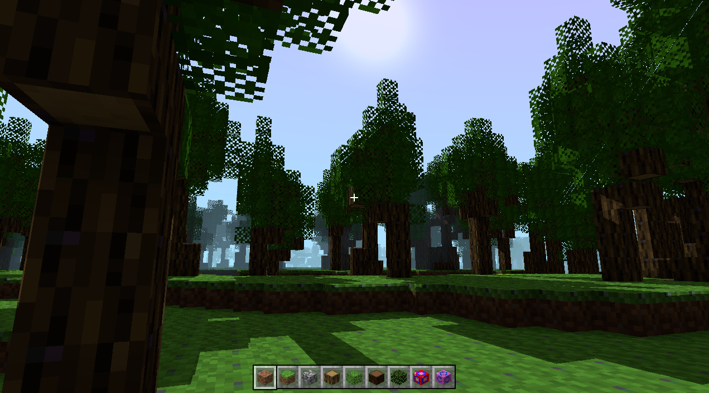
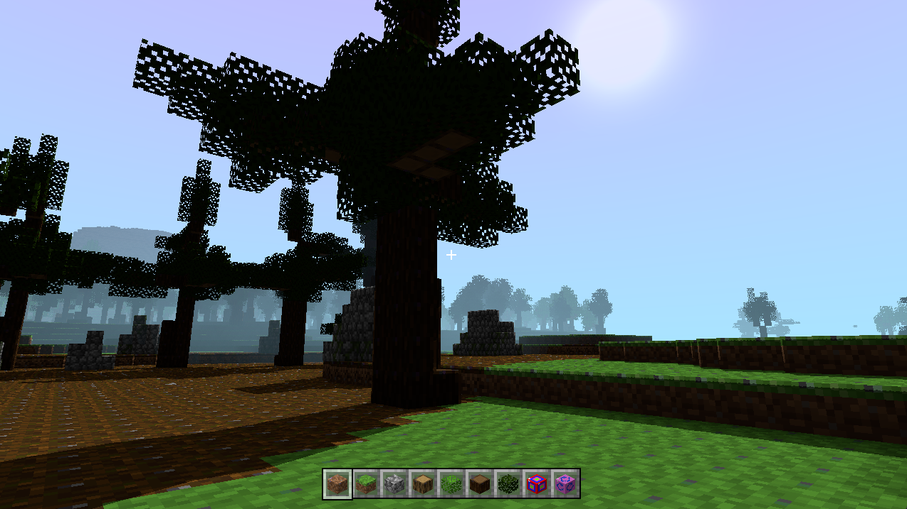

Cool thing I made in two weeks.

This project is supposed to be sort of a Minecraft clone to show off my skills in graphics
programming.

A web version of this project is available at https://nils-mathieu.fr/blocks_n_stuff/, but it's a bit buggy. I would definitely recommend using the native version if possible. Prebuilt binaries are available in the [releases] tab, or you can follow
the instructions below to build it yourself (you only need a basic Rust toolchain!).

See the [FEATURES.md] for a list of features.

[releases]: https://github.com/nils-mathieu/blocks_n_stuff/releases

## Credits

The textures are from the [8bit Craft 2](resourcepack) resource pack by [burritoeatinghamster
].

[resourcepack]: https://www.curseforge.com/minecraft/texture-packs/tobiks-8-bitcraft-2
[burritoeatinghamster]: https://www.curseforge.com/members/burritoeatinghamster/projects

Most sound effects are from Minecraft, except from the music that I created myself.

The font is a public domain font often used in systems development because it comes in a
C header file. <https://github.com/dhepper/font8x8>

Most structures are built by my little brother.

## Screenshots

Structures can be added easily to the game using in-game tools. After that, a simple macro
can be used to add it in game.

The world generator is easily customizable, biomes can be added and modified easily.

A debug menu is available to check the performance of the game, as well as
some statistics about the world (I also wanted to show off my render distance :p ).

Here are some miscellaneous screenshots:

## Technologies

This project uses the following thrid-party Rust libraries:

- `wgpu`, a cross-platform abstraction over Vulkan, Metal, DX12, OpenGL and WebGPU. I would've
  liked to use Vulkan directly, but that would make the project unusable on web, which I really
  want to target.
- `winit`, a cross-platform windowing library.
- `glam`, a linear algebra library that makes use of SIMD instructions to optimize most operations.
- `png`, a PNG image decoder/encoder.
- `rodio` for cross-platform audio playback library.

## Keybindings

### Movements

| Key                     | Action         |
| ----------------------- | -------------- |
| <kbd>W</kbd>            | Move forward   |
| <kbd>A</kbd>            | Move left      |
| <kbd>S</kbd>            | Move backward  |
| <kbd>D</kbd>            | Move right     |
| <kbd>Space</kbd>        | Fly Up         |
| <kbd>Left shift</kbd>   | Fly Down       |
| <kbd>Left control</kbd> | Sprint         |
| <kbd>C</kbd>            | Previous block |
| <kbd>V</kbd>            | Next block     |

### Misc

| Key                   | Action                   |
| --------------------- | ------------------------ |
| <kbd>Escape</kbd>     | Exit game                |
| <kbd>R</kbd>          | Re-create world          |
| <kbd>U</kbd>          | Increase time speed      |
| <kbd>Arrow up</kbd>   | Increase render distance |
| <kbd>Arrow down</kbd> | Decrease render distance |
| <kbd>F9</kbd>         | Toggle shadows           |
| <kbd>F10</kbd>        | Toggle fog               |
| <kbd>F11</kbd>        | Toggle fullscreen        |

### Debug

| Key           | Action               |
| ------------- | -------------------- |
| <kbd>F3</kbd> | Toggle debug overlay |
| <kbd>F4</kbd> | Toggle chunk borders |
